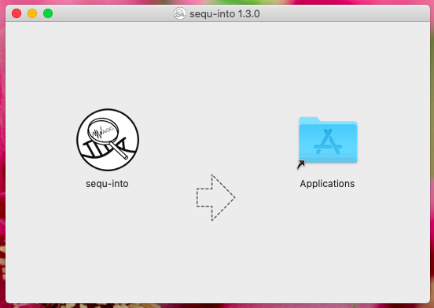

.. _installguide:

**********************
Installation
**********************

All pre-built binary releases can be found at `GitHub <https://github.com/mjoppich/igem_munich_2018/releases>`_ .

However, the python scripts rely on additional software which must be made available.

====
Mac OS
====

To be able to install sequ-into on your Mac OS system, first make sure you have all support packages. **It is important to add them in this order.**

Support Package Installation:
====

1. **X-Code developer tools**

In oder to install python and required dependencies, you must prepare your Mac OS to have xcode-select tools installed (this is a package provided by Apple/Mac OS). Mac OS users can do so by running
::
    xcode-select --install

in the terminal.

Follow the instructions displayed on your computer. Mac OS will download and install all required packages.

After having installed xcode-select, you can install sequ-into.

Install sequ-into
====

In order to install sequ-into, go to the `sequ-into repository <https://github.com/mjoppich/igem_munich_2018>`_  and download the Mac OS release.

A DMG image will be downloaded. Open the image and drag the sequ-into app into your applications folder.

You are now ready to start sequ-into. It might be necessary to convince Mac OS to run this app for security reasons. We have created a brief tutorial which shows you how you can achieve this: :ref:`macossecurityinstall` .

Install dependencies
====

The authors of sequ-into prepared a shell script to automatically install the required python dependencies. 
You can access it from the first step description menu:

Click on the *Setup MAC OS Environment* button and enter your user account password (you must be administrator). Beware, that due to technical limitations, your password will be shown on the console once.

====
Windows
====

Since Microsoft Windows is the only not POSIX based operating system supported by sequ-into, a little more action must be taken.

If you have not yet installed Windows Subsystem for Linux (also known as WSL/Bash on Ubuntu/Ubuntu/...) please do so.
We have prepared a guide on how to do so in the chapter  :ref:`wslsetupguide` .

Installing Packages into WSL 
====

After you have installed WSL, we must install some dependencies that are needed by our application.
Please note, the following guide is aimed at having an Ubuntu installed. However, if you have installed a different distribution, we are sure you know what you are doing and hence, you don't need detailed help ;) .

.. _wslpackinstall:

Package Installation (Automatic)
====

The easist way to install all dependencies is to expand the description on the first step and click the *Setup WSL environment* button:

This starts a *cmd* script which asks you for your *WSL* password and will execute the below steps automatically.

Package Installation (Manual)
====

Unfortunately sequ-into depends on several smaller libraries and applications, which we now have to install into WSL.
:: 
    sudo apt-get update
    sudo apt-get install git build-essential python3 python3-pip hdf5-tools libhdf5-serial-dev
    sudo pip3 install mappy matplotlib h5py flask pandas upsetplot

You will be asked to enter your *WSL* password when you submit your first *sudo* command. However, since *sudo* will give you administrator right in *WSL*, it might also be that it asks for your password everytime.

The following will explain the packages and software going to be installed. Since you provided your *sudo*-password, you should get to know what we are doing ;) If you are not interested: congratulations, you're done!

First a basic developer package has to be installed, which is done by installing *git* for version control/access to repositories, *build-essential* to get C/C++ compilers (to build other software) and python3 for generating reads from fast5 files and making the statistics.
*python3-pip* is the python package manager which we need to install some python packages, and finally libhdf5 is needed to access fast5 files. For alignment of the reads we rely on `mappy/minimap2 <https://pypi.org/project/mappy/>`_ .

After you have completed these steps, you are ready to use sequ-into!

Executable
====

We have built sequ-into as a portable app. You thus only need to place the downloaded executable at any location and can start using it (after you have setup *WSL* once on your computer).

====
Linux/Source
====

We are not providing a binary download for Linux, since we assume that you are familiar with the command line, if your computer runs Linux.
In explanation on why a software is needed can be found above at :ref:`_wslpackinstall` .

First you must clone the `sequ-into repository <https://github.com/mjoppich/igem_munich_2018>`_ , install with npm and finally build our tool.
::
    git clone https://github.com/mjoppich/igem_munich_2018.git
    cd igem_munich_2018
    npm install

    npm run build
    npm package-linux

You will find the sequ-into application in igem_munich_2018/release/ .

In order to have all python scripts running, please install the following dependencies. You may leave *python3-pip* out if you are using your own pip or anaconda.
::
    sudo apt-get update
    sudo apt-get install git build-essential python3 python3-pip hdf5-tools libhdf5-serial-dev
    sudo pip3 install mappy matplotlib h5py flask pandas upsetplot

.. _macossecurityinstall:

====
Overriding Mac OS security settings
====

In order to execute non-App-store apps on Mac OS, you must force your Mac to do so (or pay the authors some money, so we can afford the registration :) ).

Upon downloading and dragging sequ-into into the Apps folder on your Mac (Programme folder in the screenshots), you can double-click on the sequ-into app.

A popup will be shown, telling you that you download sequ-into from some remote location and that the app is not signed. Hence you can either cancel or move the app into the bin.

.. image:: ./images/mac/select_app_2.png
   :scale: 40

In order to allow the execution of sequ-into, please go into your Settings -> Security -> General. Verify that you allow to download apps from the app store and verified developers.
Since you already tried to execute sequ-into once, the general page will also tell you, that the execution of the *sequ-into* app has been blocked, because it has not been created by a verified developer. A button enables you to open sequ-into anyway. Click on that button.

After hitting the button to open sequ-into anyway, another popup will be shown. It will again tell you that Mac OS does not know who created the app, and that this app is potentially unsafe. This time, it also allows you to *Open* the app. Click on *Open*.

After all these steps, we could finally convince Mac OS to run sequ-into. Congratulations!

