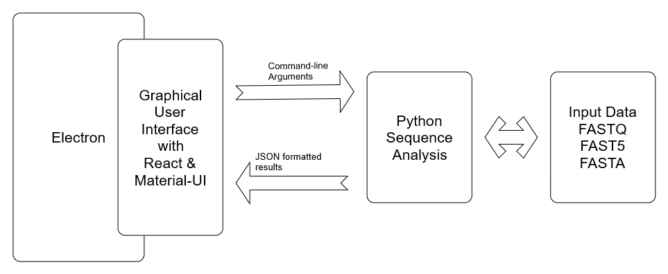

.. _methods:

********************
How does Sequ-Into work?
********************

*sequ-into* has the aim of bringing the sequencing data analysis and the laboratory protocol optimization in close proximity. 

While highly specialized tools and pipelines for third generation sequencing data analysis are available, they often are not handy nor convenient to use as a first assessment right after or during the sequencing run.

As a possible solution we brought together a straightforward intuitive interface built with `Electron <https://electronjs.org>`_ and `React <https://reactjs.org>`_, that gives the user easy access to the state-of-the-art long read alignment tool `GraphMap <https://www.nature.com/articles/ncomms11307>`_ which itself is highly specialized for nanopore sequencing. 

To make this possible we run a python script in the background that relies on `HTSeq <https://htseq.readthedocs.io/en/release_0.10.0/>`_ as infrastructure for high-throughput data and `pysam <https://pysam.readthedocs.io/en/latest/>`_ to handle the genomic data sets.

====
What does sequ-into do?
====

.. image:: ./images/workflow_overview.png
   :scale: 40

In order to be able to draw conclusions of the sequencing quality in general and the composition of the data - in terms of contaminations versus the true sequencing traget - the reads are mapped to references. The reference being either a possible contamination, leaving your desired reads unaligned, or your target sequence, meaning your designated reads are the ones that did align.
The distribution of read length from the original files and the results of these alignments are then elucidated in a statistical overview and employed to separate those reads you aimed for from those that were sequenced involuntary.

====
How does sequ-into achieve this?
====

From a Typescript interface to functionality
====

The user interface of *sequ-into* is based on Electron and React and written in Typescript. However, the functionality of our app depends on a python script (ContamTool.py_) in the background, that must be called according to the users request.

**Read Files**

*sequ-into* is able to deal with both, the FastQ as well as the Fast5 format. If the latter is used, we extract the base called sequences and convert them into the FastQ format.

Thanks to the fact that the Fast5 format is in fact `HDF5 <https://support.hdfgroup.org/HDF5/>`_, a file format that can contain an unlimited variety of datatypes while allowing for input/output of complex data, it was possible to manipulate the files with the `h5py <https://www.h5py.org>`_ python interface efficiently.
To prevent excessive runtimes of our app, there is currently a processing limit of 1000 reads per Fast5 file.
::
	return OrderedDict([
            (Fast5TYPE.BASECALL_2D, '/Analyses/Basecall_2D_%03d/'),
            (Fast5TYPE.BASECALL_1D_COMPL, '/Analyses/Basecall_1D_%03d/'),
            (Fast5TYPE.BASECALL_1D, '/Analyses/Basecall_1D_%03d/'),
            (Fast5TYPE.BASECALL_RNN_1D, '/Analyses/Basecall_RNN_1D_%03d/'),
            (Fast5TYPE.BARCODING, '/Analyses/Barcoding_%03d/'),
            (Fast5TYPE.PRE_BASECALL, '/Analyses/EventDetection_%03d/')
        ])

After acquiring the sequenced data meant to be analyzed, *sequ-into* handles each uploaded file/folder as a separated call. In the case of a folder, *sequ-into* searches for each file in that directory down to the deepest level of the directory tree.
::
    self.state.inputFiles.forEach(element => {

            var stats = fs.lstatSync(element.path)
            
            if (stats.isDirectory()){
                var allFilesInDir = fs.readdirSync(element.path);
                processFilesForElement[element.path] = [];

                allFilesInDir.forEach((myFile:any) => {
                    if(myFile.toUpperCase().endsWith("FASTQ") || myFile.toUpperCase().endsWith("FQ")){
                        var pathToFile = self.normalizePath(path.join(element.path, myFile));
                        processFilesForElement[element.path].push(pathToFile)
                    }
                });

                if (processFilesForElement[element.path].length == 0){
                   self.extractReadsForFolder(element.path);
                }
            }else{
                processFilesForElement[element.path] = [self.normalizePath(element.path)];
            }
        });

All files that are pooled in a folder are handled as one file in the further steps (ContamTool.py_), resulting in a combined analysis of all the files in that folder.

**Reference Files**

The next step is to acquire the FastA files that are used as a reference for the alignment. As the user might have similar requests repeatedly, it is possible to save reference files in the app itself.
To make these files available even after the app is closed, we use a `JSON <https://www.json.org>`_ file to store their paths internally together with our default genome of *Escherichia coli* K-12 MG1655.

**Cross Plattform Compatibility**

Now that the required data is accessible, the python script (ContamTool.py_) handling the alignment, calculation and plotting can be called.

As the alignment-tool_ we employed in our python script runs asynchron but since we have to make several calls for the functionality of *sequ-into*, one for each file per reference, we call the python script sequential.
::
	child = spawnSync(
            program, 
            programArgs,
                {
                    cwd: process.cwd(),
                    env: process.env,
                    stdio: 'pipe',
                    encoding: 'utf-8',
                    shell: useShell
                })

To facilitate this on every platform *sequ-into* formulates the call command accordingly.

For a Unix system, this is simply:
::
    var splitted_command = command.split(" ");
    program = "python3";
    programArgs = splitted_command;
    useShell = true;

For Mac OS, the explicit path to all files is needed additionally:
::
	var np = shellPath.sync();
	process.env.PATH = np; 

On Windows, however, it is necessary to make the call `WSL <https://docs.microsoft.com/en-us/windows/wsl/about>`_ compatible:
::
	var splitCmd = ["-i", "-c", "python3 " + command];
	program = "bash";
	programArgs = splitCmd;
	useShell = false;

**Script Output**

The output of each python call - that is for each file per reference - is collected via another JSON file data structure. More details here_.

ContamTool.py
====

As mentioned above the functionality of *sequ-into* depends on the python script ContamTool.py which assesses the input read files, coordinates the alignment, interprets the alignment results and allows for read extraction according to the gained knowledge.

**Read File Handling**

All files that are pooled in a folder are handled as one FastQ file in the further steps to make the combined analysis possible.
::
	fastqFile = os.path.join(output_dir, prefix + "complete.fastq")
	os.system("cat " + ' '.join(read_file) + " > " + fastqFile)

`HTSeq <https://htseq.readthedocs.io/en/release_0.10.0/>`_ allows for an efficient iteration over all reads from the now single input file.
::
	reads = HTSeq.FastqReader(read_file)
	for read in reads:
		...

.. _alignment-tool:

**Calling the Alignment Tool GraphMap**

The idea behind *sequ-into* that enables finding possible contaminations and deciding if a certain target was sequenced, respectively, is to map the raw reads from the sequencing files against a reference. Thus allowing to split the original joint read file into two categories: the reads that aligned to the reference and those that did not.

Nanopore sequencing data, however, comes with certain obstacles that complicate alignments. 
On the one hand, because of Nanopores high-throughput nature, the data size means that alignment algorithms commonly used are too slow - something that was overcome only with a tradeoff to lower sensitivity. On the other hand, the variable error profile of ONT MinION sequencers made parameter tuning mandatory to gain high sensitivity and precision.
What makes *sequ-into* a reliable tool nevertheless, is GraphMap. This mapping algorithm is specifically designed to analyse nanopore sequencing reads, while it handles potentially high-error rates robustly  and aligns long reads with speed and high precision thanks to a fast graph traversal. (`Nature 2016, Sovic et al. <https://www.nature.com/articles/ncomms11307>`_)

For each reference, GraphMap is called with the input read file, generating a `Sequence Alignment Map <https://samtools.github.io/hts-specs/SAMv1.pdf>`_.
::
	for file in cont_file:
		sam_file_name = os.path.split(file)[1][:-6]+".sam"
		samFile = os.path.join(output_dir,prefix + sam_file_name)
		os.system("graphmap align -r "+file+" -d "+read_file+" -o "+samFile)

**Evaluating the GraphMap Output**

With the pysam interface it is now easy to count the features of interest directly from the corresponding sam file for each reference:
::
	for aln in samFile:
		totalBases += len(aln.seq)
		totalReads += 1
		if not aln.is_unmapped:
			alignmentBases += aln.alen
			alignedLength += len(aln.seq)
			alignedReads += 1

.. _here:

**ContamTool.py Output**

The read file is assest for each reference. ContamTool.py produces three images per reference from the generated data. 
A read length distribution of the original FastQ file/ files and two pie charts showing the percentage of aligned and not aligned reads or bases.
The collected data, as well as the paths to the images are dumped in a JSON file for easy handling in the further steps.
::
    {
    "/pathToReference/ecoli_k12_mg1655.fasta": 
        {
            "totalReads": 7, 
            "alignedReads": 0, 
            "totalBases": 62387, 
            "alignmentBases": 0, 
            "alignedLength": 0, 
            "idAlignedReads": [], 
            "idNotAlignedReads": ["c9a72623-c55c-4464-ac5e-d1e70cea8466", "4b57cb5c-0c3d-4650-9d57-c94cf4aea2ef", ...], 
            "readLengthPlot": "/outputPath/file2_ecoli_k12_mg1655_ref1_ref2_reads_length.png", 
            "readsPie": "/outputPath/file2_ecoli_k12_mg1655_ref1_ref2_read_pie.png", 
            "basesPie": "/outputPath/file2_ecoli_k12_mg1655_ref1_ref2_bases_pie.png", 
            "refs": ["/pathToReference/ecoli_k12_mg1655.fasta"]}, 
    
    "/pathToReference/ref1.fasta": 
        {
            "totalReads": 7, 
            "alignedReads": 0, 
            ...},

    "/pathToReference/ref2.fasta":
        {
            "totalReads": 7, 
            "alignedReads": 0, 
            ...}

**Extracting Read Files**

Besides the contamination evaluation, *sequ-into* furthermore allows for a separation of the reads into the ones that aligned to the reference versus the ones that that did not align.
It generates new FastQ files according to the users inquiry which can then be used in a more elaborate downstream analysis.
One notable possibility that *sequ-into* offers, is the extraction of reads against several references at once. Exporting only those reads in the end that represent the intersection (red) of reads aligned against all references or none, according to set theory.

.. image:: ./images/intersection.png
   :scale: 50

