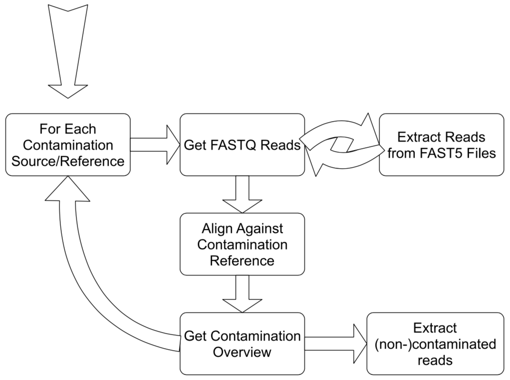

.. _methods:

********************
How does Sequ-Into work?
********************

*sequ-into* has the aim of bringing the sequencing data analysis and the laboratory protocol optimization in close proximity. 

While highly specialized tools and pipelines for third generation sequencing data analysis are available, they often are not handy nor convenient to use as a first assessment right after or during the sequencing run.

As a possible solution we brought together a straightforward intuitive interface built with `Electron <https://electronjs.org>`_ and `React <https://reactjs.org>`_, that gives the user easy access to the state-of-the-art long read alignment tool `GraphMap <https://www.nature.com/articles/ncomms11307>`_ which itself is highly specialized for nanopore sequencing. 

To make this possible we run a python script in the background that relies on `HTSeq <https://htseq.readthedocs.io/en/release_0.10.0/>`_ as infrastructure for high-throughput data and `pysam <https://pysam.readthedocs.io/en/latest/>`_ to handle the genomic data sets.

====
What does sequ-into do?
====

In order to be able to draw conclusions of the sequencing quality in general and the composition of the data - in terms of contaminations versus the true sequencing traget - the reads are mapped to references. The reference being either a possible contamination, leaving your desired reads unaligned, or your target sequence, meaning your designated reads are the ones that did align.
The distribution of read length from the original files and the results of these alignments are then elucidated in a statistical overview and employed to separate those reads you aimed for from those that were sequenced involuntary.

====
How does sequ-into achieve this?
====

Python Call
====

**Read Files**

*sequ-into* is able to deal with both, the FastQ as well as the Fast5 format. If the latter is used, we extract the base called sequences and convert them into the FastQ format.

Thanks to the fact that the Fast5 format is in fact `HDF5 <https://support.hdfgroup.org/HDF5/>`_, a file format that can contain an unlimited variety of datatypes while allowing for input/output of complex data, it was possible to manipulate the files with the `h5py <https://www.h5py.org>`_ python interface efficiently.
To prevent excessive runtimes in our app, there is currently a processing limit of 1000 reads per Fast5 file.
::
	return OrderedDict([
            (Fast5TYPE.BASECALL_2D, '/Analyses/Basecall_2D_%03d/'),
            (Fast5TYPE.BASECALL_1D_COMPL, '/Analyses/Basecall_1D_%03d/'),
            (Fast5TYPE.BASECALL_1D, '/Analyses/Basecall_1D_%03d/'),
            (Fast5TYPE.BASECALL_RNN_1D, '/Analyses/Basecall_RNN_1D_%03d/'),
            (Fast5TYPE.BARCODING, '/Analyses/Barcoding_%03d/'),
            (Fast5TYPE.PRE_BASECALL, '/Analyses/EventDetection_%03d/')
        ])

After acquiring the sequenced data meant to be analyzed, *sequ-into* handles each uploaded file/folder as a separated call. In the case of a folder, *sequ-into* searches for each file in that directory down to the deepest level of the directory tree.
::
	self.state.inputFiles.forEach(element => {

            var stats = fs.lstatSync(element.path)
            
            if (stats.isDirectory()){
                var allFilesInDir = fs.readdirSync(element.path);
                processFilesForElement[element.path] = [];

                allFilesInDir.forEach((myFile:any) => {
                    if(myFile.toUpperCase().endsWith("FASTQ") || myFile.toUpperCase().endsWith("FQ")){
                        var pathToFile = self.normalizePath(path.join(element.path, myFile));
                        processFilesForElement[element.path].push(pathToFile)
                    }
                });

                if (processFilesForElement[element.path].length == 0){
                   self.extractReadsForFolder(element.path);
                }
            }else{
                processFilesForElement[element.path] = [self.normalizePath(element.path)];
            }
        });

All files that are pooled in a folder are handled as one FastQ file in the further steps.
::
	fastqFile = os.path.join(output_dir, prefix + "complete.fastq")
	os.system("cat " + ' '.join(read_file) + " > " + fastqFile)

**Reference Files**

The next step is to acquire the FastA files that are used as a reference for the alignment. As the user might have similar requests repeatedly, it is possible to save reference files in the app itself.
To make these files available even after the app is closed, we use a `JSON <https://www.json.org>`_ file internally to store their paths together with our default genome of *Escherichia coli* K-12 MG1655.

Enter this in your terminal: 
::
    conda config --add channels defaults
    conda config --add channels bioconda
    conda config --add channels conda-forge

