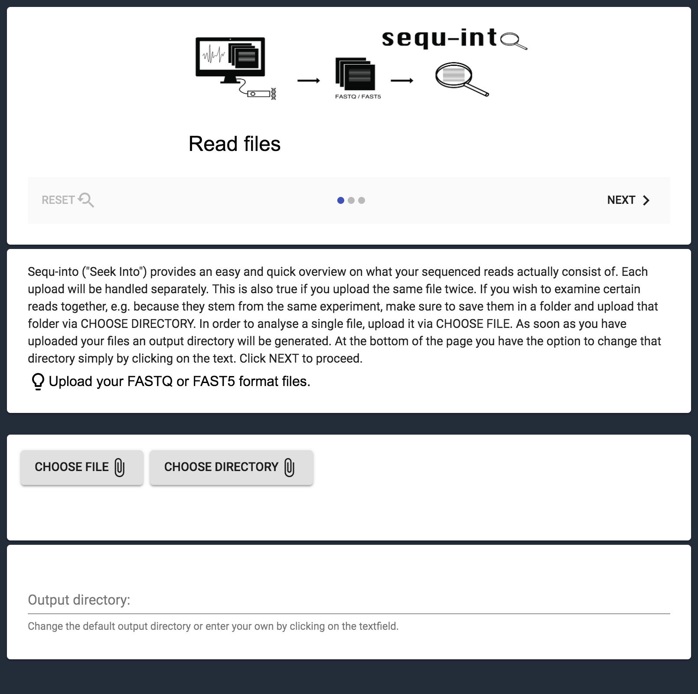
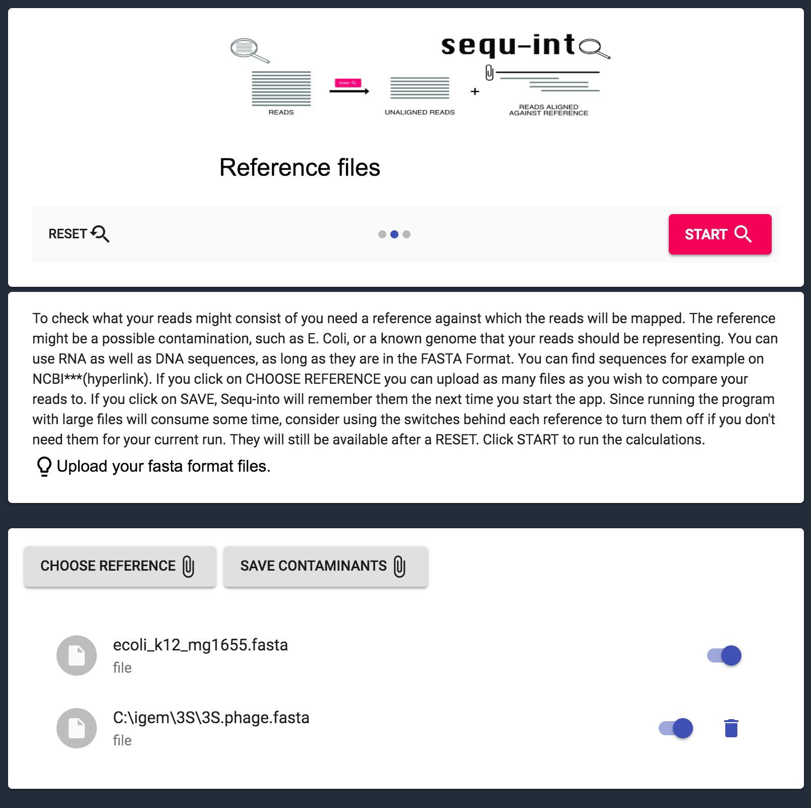
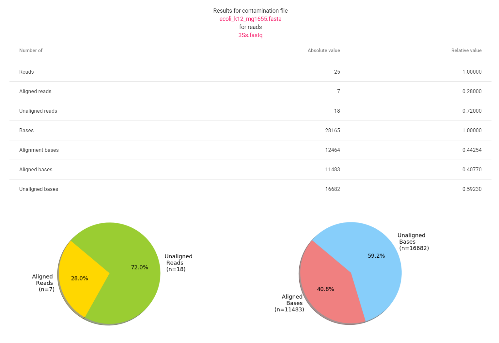
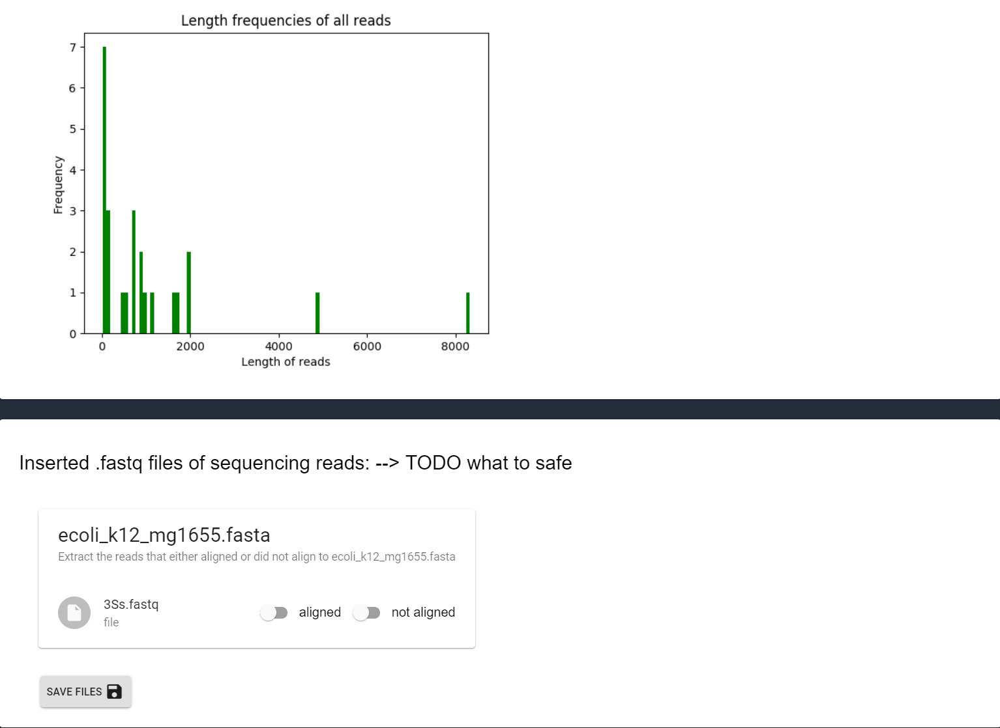

.. _userguide:

********************
User Guide
********************

How to get sequ-into?
====
idk

Install sequ-into
====
Windows
-------
idk

Linux
-------
idk

Mac OS
-------
idk

Get started
====
Read files
-------
To evaluate your sequencing data, you need to choose them in the app. FastQ as
well as Fast5 are suitable file formats.

Each upload will be handled separately. This is also true if you upload the same
file twice. If you wish to examine certain reads together, e.g. because they stem
from the same experiment, make sure to save them in a folder and upload that folder
via CHOOSE DIRECTORY. In order to analyze a single file, upload it via CHOOSE FILE.

As soon as you have uploaded your files an output directory will be generated,
which you can also change at the bottom of the page. After that, click NEXT to proceed.

Reference files
-------
To check what your reads might consist of you need a reference against which
the reads will be mapped. The reference might be a possible contamination,
such as E. Coli, or a known genome that your reads should be representing.

You can use RNA as well as DNA sequences, as long as they are in the FASTA Format.
You can find sequences for example on NCBI https://www.ncbi.nlm.nih.gov/genome/?term=.

If you click on CHOOSE REFERENCE you can upload as many files as you wish to
compare your reads to. If you use SAVE REFERENCE to upload a file,
*sequ-into* will remember that reference the next time you start the app.

Since running the program with large files will consume some time,
consider using the switches behind each reference to turn them off if you don't
need them for your current run. They will still be available after a RESET.
After that, click START to run the calculations.

Results
-------
The Results consist of two parts:
a statistical overview on how your reads mapped to the reference(s) and the
possibility to extract and save only those filtered reads you need for your downstream analysis.

