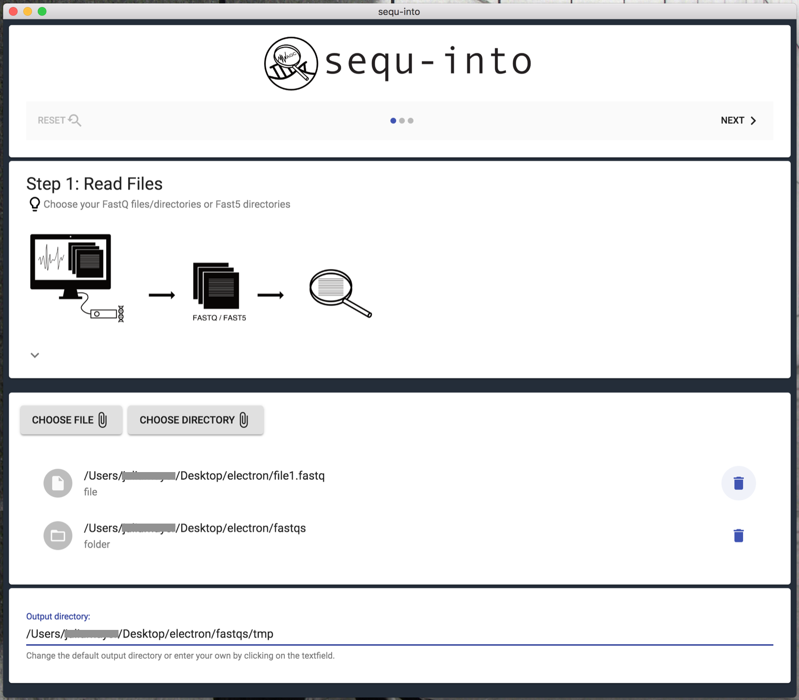
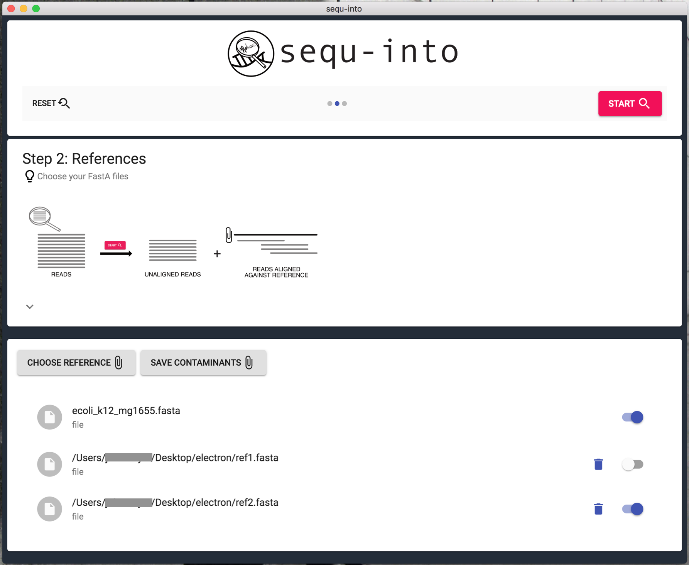
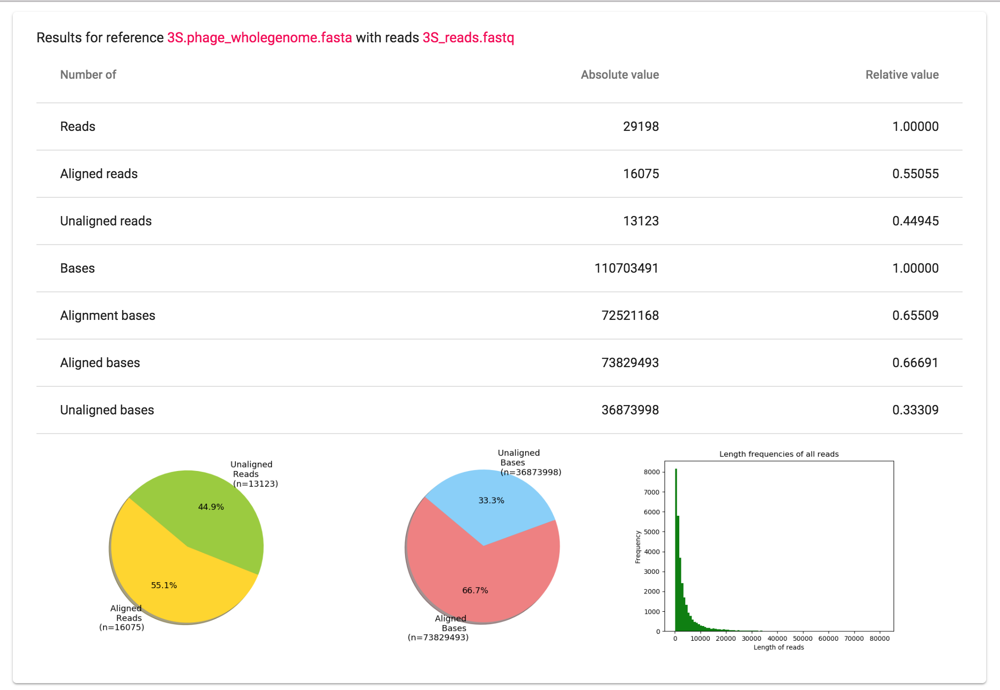
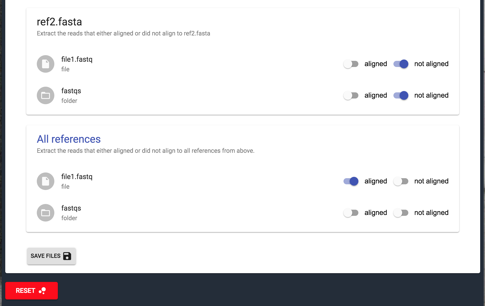

.. _userguide:

********************
User Guide
********************

How to get sequ-into?
====
You can use *sequ-into* on a Mac OS, Linux as well as on a Windows System. Please follow the respective instructions in our :ref:`installguide` guide.

Get started
====

Step 1: Read files
-------
FastQ, as well as Fast5, are suitable formats for evaluating your sequencing data with *sequ-into*.

In the first step, you can choose which files you would like to seek into. Each chosen file or folder will be handled separately. This is also true if you upload them twice. 

If you wish to examine certain reads together, e.g. because they stem from the same experiment, make sure to save them in a folder and upload that folder via *Choose Directory*. In order to analyze a single file, upload it via *Choose File*.

As soon as you have chosen your files an output directory will be generated. You will find a temp folder where your read files reside. You can change that output directory and folder name at the bottom of the page if you click on the text field.

After that, click *Next* to proceed.

Step 2: Reference files
-------
To check what your sequencing files truly consist of you need a reference against which the reads will be mapped. 

That reference might be a possible contamination, such as *E. Coli*, or a targeted known genome of what you intended to sequence. Of course, you can also use shorter sequences instead of a whole genome as a reference. For details on possible technical limitations, please see `GraphMap <https://github.com/isovic/graphmap>`_ and https://www.nature.com/articles/ncomms11307.

Mapping is possible against RNA as well as against DNA sequences, as long as they are in the FastA Format. You can find sequences for example on NCBI https://www.ncbi.nlm.nih.gov/genome/?term=.

Click on *Choose Reference* to choose your reference files. You can select as many files as you wish. These files will still be present after you used *Reset*, but are deleted when you close the application.

If you work with certain references repeatedly they can also be saved in the app so that they are available every time even after you closed *sequ-into*. For this, choose the reference via *Save Contaminants*. Your own references can always be deleted from *sequ-into* later on, just click the trash can to do so.

**Keep in mind that calculation time increases with file size and file quantity!** Consider using the switches behind each reference to turn them off if you don't need them for your current run. They will still be available after you used *Reset*.

After that, click *Start* to run the calculations.

Step 3: Results
-------

The Results consist of two sections: a statistical overview on how your reads mapped to the reference(s) and the filter to extract and save only those reads you need for your downstream analysis.

Section 1:
-------

For each combination of FastQ (file/directory) with FastA you will find one table and three plots. 

   
The table includes read and base frequencies in the reference FastA file. For reads, you receive the information about aligned or not aligned reads. It is not always sufficient enough to rely only on reads in the further analysis. The different read sizes can cause the wrong interpretation of the data: three contaminated reads of length 50 bp or 5000 bp make a big difference despite the fact that there is three of them in both cases. For making proper conclusions about the data it is useful to take a look on the bases as well. For bases, it is important to note that there are two different definitions: *alignment bases* and *aligned bases*. 

Aligned reads consist out of bases. These bases are called the *aligned bases*. On the other hand, the bases that are indeed aligned, means mapped to the base in the reference and are not skipped, are called *alignment bases*. 

To support the statistical information in the table visually we also added two pie charts that correspond to the relative and absolute values in the table. These two plots will help you to gain information about the number of bases and reads that were found in a reference file and make a conclusion about the possibility of contamination. 

Additionally, there is a bar plot representing the distribution of the read length in the FastQ file you uploaded. This chart could be used for evaluation of the quality of sequencing or even be helpful by evolving theories about files with filtered reads. For your сonvenience **all plots are saved in the output directory.**

Section 2:
-------

In the section below you will find a filter which you can optionally use to extract and save distinguish parts of the read FastQ file: reads that were mapped to the reference (*aligned switch*) and those which were not (*not aligned switch*), in other words possibly contaminated reads and reads that can be used for downstream analysis (in case the reference FastA file you used is a possible contaminant. If you added the FastA file of the organism you expect to sequence, *not aligned* reads are contamination).

If you uploaded multiple references files one more filter will appear (*All references*): filter of reads that are aligned to **all** references or reads that are aligned to **none** of the references. 

With this filter, it is possible to refine sequencing data and consequently, achieve preferable results by downstream analysis. It can also give you a hint about the origin of the possible contamination, as the reads that are not mapped to the expected organism can be checked with `BLAST <https://blast.ncbi.nlm.nih.gov/Blast.cgi>`_.

Once again all files will be saved in your output directory.
